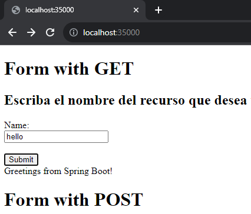
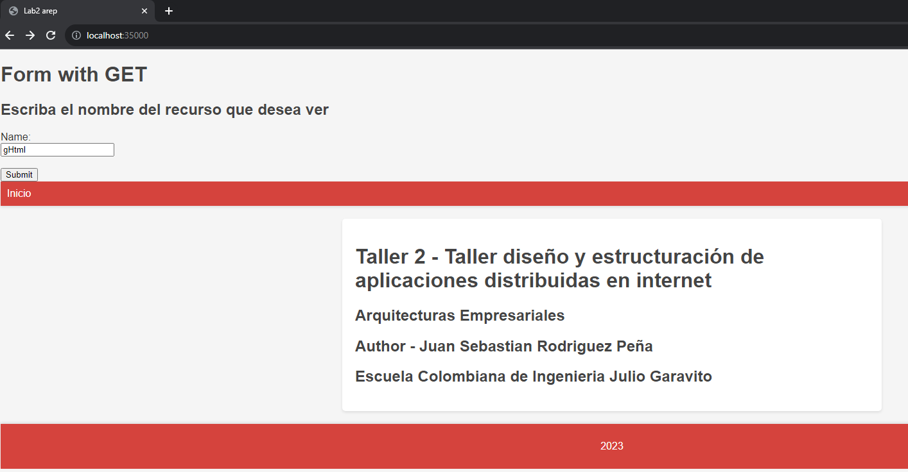
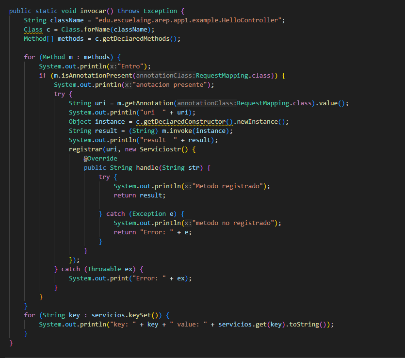
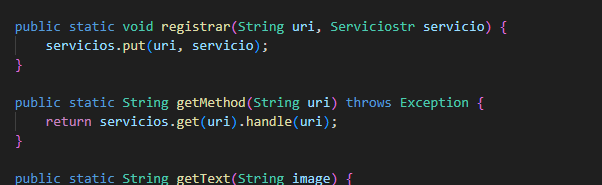
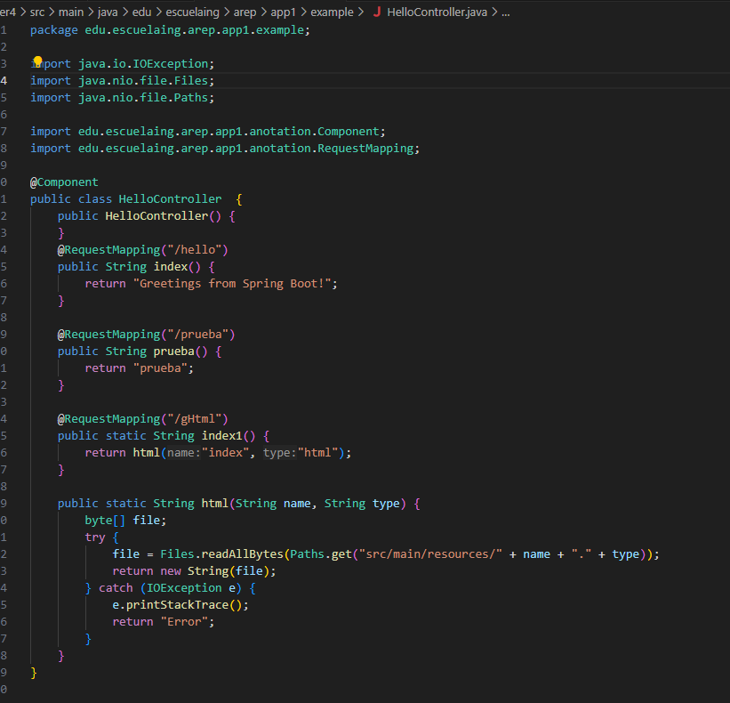

# Taller de Arquitecturas de Servidores de Aplicaciones, Meta protocolos de objetos, Patrón IoC, Reflexión

En este repositorio se encuentra un servidor capax de entregar paginas html, e imagenes, provee un framework IoC para la construccion de paginas web a partir de POJOS

## Para empezar

Descargue o copie el repositorio en su maquina local.

### Prerequisitos

- Java
- Maven

### Ejecucion

Para ejecutar el comando por favor ubiquese en la carpeta de taller4 y ahi ingrese el siguiente comando:

```
mvn package
```

Y para ejecutar el servidor ingrese el siguiente comando:

```
java -cp target/classes edu.escuelaing.arep.app1.spark.Spark
```

Al estar este en estado de "Listo para recibir ..." Dirigase a la siguiente pagina

```
http://localhost:35000/
```


La pagina deberia verse asi:


Las opciones que tenemos son:

* hello
* prueba
* gHtml


La pagina deberia verse asi cuando llamamos hello:



La pagina deberia verse asi cuando llamamos gHtml:




## Description

Se le implementaron 3 metodos a la clase HttpServer, los cuales son:




el metodo invocar se encarga de agregar los servicios al hashmap, revisando por consola su ejecucion paso por paso, usando el metodo registrar para facilitar la lectura del codigo. Y usamos el getMethod para obtener el metodo que se va a ejecutar al momento de correr la aplicacion.


La clase con la anotacion es la que nos va a devolver en este caso los recursos que tenemos, como se especifico anteriormente son 3, y uno de estos es una respuesta de tipo html, el cual se puede ver su metodo para retornarla.

## Built With

- [Maven](https://maven.apache.org/) - Gestión de dependencias
- [JAVA](https://rometools.github.io/rome/) - Lenguaje de programacion utlizado

## Authors

- **Juan Sebastian Rodriguez Peña** - [JSebastianRod](https://github.com/JSebastianRod)
